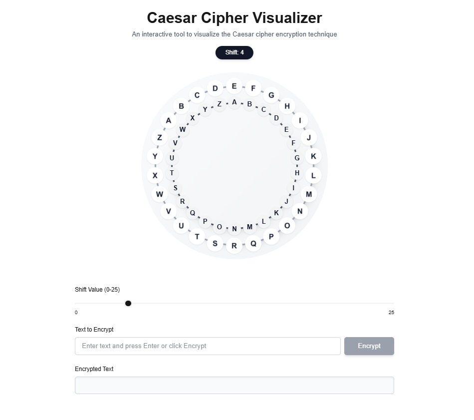

# Caesar Cipher Visualizer

A modern, interactive web application that visualizes the Caesar cipher encryption technique. This project demonstrates classical cryptography with a clean, modern UI inspired by Vercel's design aesthetic.



## Features

- **Interactive Cipher Visualization**: Two concentric rings that visually demonstrate the Caesar cipher substitution
- **Real-time Encryption**: Watch as each character is encrypted with an animated visualization
- **Adjustable Shift Value**: Easily change the encryption key (shift value) with a slider
- **Modern UI**: Clean, responsive design with dark mode support
- **Comprehensive Testing**: Fully tested with Jest and React Testing Library

## Technologies Used

- Next.js 15
- React 19
- TypeScript
- Tailwind CSS
- Jest & React Testing Library

## Getting Started

### Prerequisites

- Node.js 18.17 or later

### Installation

1. Clone the repository:
   ```bash
   git clone https://github.com/yourusername/caesar-cipher-visualizer.git
   cd caesar-cipher-visualizer
   ```

2. Install dependencies:
   ```bash
   npm install
   ```

3. Run the development server:
   ```bash
   npm run dev
   ```

4. Open [http://localhost:3000](http://localhost:3000) in your browser to see the application.

## How It Works

The Caesar cipher is one of the simplest and most widely known encryption techniques. It works by shifting each letter in the plaintext by a fixed number of positions down the alphabet.

For example, with a shift of 3:
- A → D
- B → E
- C → F
- ...and so on

This application visualizes this process with two concentric rings:
- The outer ring represents the ciphertext alphabet
- The inner ring represents the plaintext alphabet
- The outer ring rotates based on the shift value

When you enter text and click "Encrypt", you can watch as each character is processed and the corresponding encrypted character is added to the output.

## Testing

Run the test suite with:

```bash
npm test
```

## License

This project is licensed under the MIT License - see the LICENSE file for details.

## Acknowledgments

- Inspired by classical cryptography techniques
- UI design inspired by Vercel's clean aesthetic
